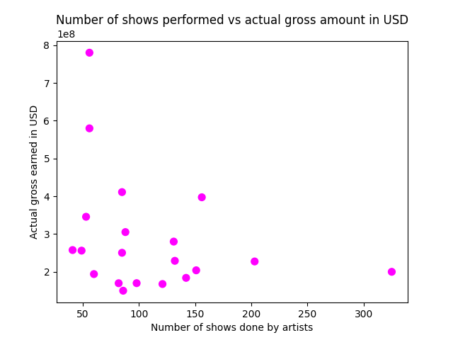
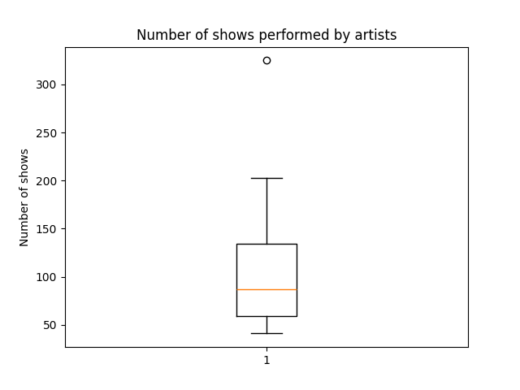
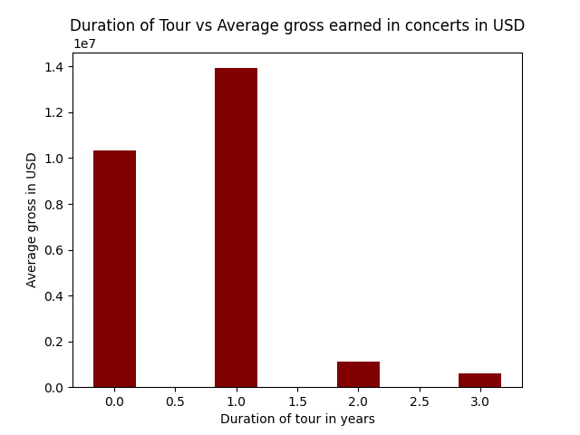

# Data Analysis of Highest Grossing concert tours by women📊
This project contains data cleaning, exploratory data analysis, data visualization, and finding insights from a messy dataset of highest grossing concerts by women. 🎤🎼🎵

  
  
  
  

## Dataset🔗
- Source: Kaggle 
- Source url: https://www.kaggle.com/datasets/amruthayenikonda/dirty-dataset-to-practice-data-cleaning

## Insights⭐
- Taylor Swift, and Madonna hold the highest actual gross among all the concert tours.
- Actual gross earned is higher for artists with higher ranks.
- Most of the concerts performed by Taylor Swift earned less actual gross than the few higher actual gross earned concerts by Taylor Swift.
- The Eras Tour and the Renaissance World Tour are the top 2 highest earned actual gross tours.
- The Red Tour had the lowest actual gross among all the concerts by women.
- The lesser the number of shows performed by the artists, higher the actual gross earned.
- The artists with more number of shows in the tours had lesser actual gross in USD.
- The total number of shows performed by artists has an outlier, which denotes that most of the artists had performed between 50 to 200 shows, whereas one of the artists has performed more than 300 shows.
- Tours with higher duration in years earned less actual gross.

## Visualizations📈

## Kaggle Notebook📓
https://www.kaggle.com/code/reshmaharidhas/data-cleaning-and-exploratory-data-analysis/notebook

## Tech Stack💻
- Pandas
- Numpy
- Matplotlib
- Python
